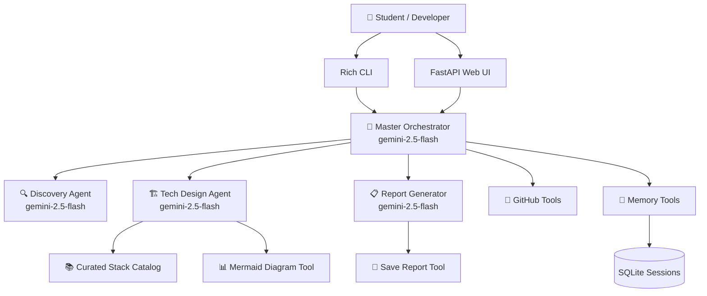

<div align="center">

# 🏗️ ProjectForge AI

### Student Technology Stack Recommender & System Architect Powered by Google ADK + Gemini

[](https://python.org)
[](https://google.github.io/adk-docs/)
[](https://ai.google.dev)
[](LICENSE)
[](tests/)

*Tell me your project idea and what you know. I'll recommend tools that teach you something new.*

</div>

---

## 📋 What Is This?

**ProjectForge AI** is a multi-agent AI system designed to act as a **student-centric software architect and technical mentor**. You describe a project idea and your current technical skillset, and the system guides you through a structured 3-stage workflow to produce a personalized, buildable learning roadmap and architecture document.

It doesn't just recommend what is easiest — it **deliberately selects modern tools that teach new programming and architectural paradigms** (e.g., Svelte's compiler-based reactivity, Go's lightweight concurrency, Supabase's Row Level Security).

### The 3-Stage Workflow

```
🔍 Discovery → 🏗️ Stack Recommendation → 📋 Report Generation
```

| Stage | What Happens |
|---|---|
| **Discovery** | Agent interviews you about your project idea, learning goals (Frontend, Backend, Database), and familiar tools |
| **Stack Recommendation** | Recommends tools from a curated catalog, contrasting new paradigms with your familiar stack and designing data schemas & APIs |
| **Report Generation** | Assembles a shareable, professional Markdown learning roadmap with Mermaid architecture diagrams |

---

## 🏛️ Architecture



**Key Architectural Features:**
- **Google ADK** multi-agent orchestration with structured `DiscoveryTurn` state transitions.
- **Gemini 2.5 Flash** with native exponential backoff and retry handling (`HttpRetryOptions`).
- **SQLite Session Persistence** via `DatabaseSessionService` across CLI and Web.
- **Real-time Dual Interfaces** — Rich interactive terminal CLI and FastAPI + WebSocket Web UI.

---

## 🚀 Quick Start

### Prerequisites
- Python 3.10 or higher
- [Google Gemini API Key](https://aistudio.google.com/apikey)

### Installation

```bash
# 1. Clone the repository
git clone https://github.com/Laharsolanki/ProjectForge-AI.git
cd ProjectForge-AI

# 2. Create and activate virtual environment
python -m venv .venv
# Windows:
.venv\Scripts\activate
# macOS/Linux:
source .venv/bin/activate

# 3. Install dependencies
pip install -r requirements.txt

# 4. Configure API key
copy .env.example .env        # Windows
# cp .env.example .env        # macOS/Linux

# Edit .env and add your GOOGLE_API_KEY
```

### Run

```bash
# Interactive CLI
python main.py cli

# Web interface
python main.py web --port 8000
# Open http://127.0.0.1:8000 in your browser
```

---

## 📂 Project Structure

```
ProjectForge-AI/
├── agents/                  # Agent definitions
│   ├── orchestrator.py      # Master orchestrator (root agent)
│   ├── discovery.py         # Stage 1: Problem & learning goals discovery
│   ├── tech_design.py       # Stage 2: Stack selection & system architecture
│   └── report_generator.py  # Stage 3: Markdown roadmap assembly
├── prompts/                 # System prompts for each agent
│   ├── orchestrator_prompt.py
│   ├── discovery_prompt.py
│   ├── tech_design_prompt.py
│   └── report_prompt.py
├── tools/                   # Custom ADK tools
│   ├── recommendation_engine.py # Curated modern technologies database
│   ├── cost_estimator.py    # Cloud cost estimation (AWS/GCP/Azure)
│   ├── github_tools.py      # Repo & issue creation
│   ├── report_tools.py      # Report saving & Mermaid diagrams
│   └── memory_tools.py      # Session memory & project summaries
├── web/                     # Web interface
│   ├── app.py               # FastAPI server + WebSocket streaming
│   ├── templates/index.html # Chat UI with stage trackers
│   └── static/              # CSS + JavaScript
├── tests/                   # Automated pytest suite
│   ├── test_tech_design.py
│   ├── test_models.py
│   └── test_tools.py
├── memory/                  # Persisted SQLite session data
├── reports/                 # Generated Markdown reports
├── config.py                # Centralized configuration & retry options
├── models.py                # Pydantic data schemas
├── cli.py                   # Rich terminal interface
└── main.py                  # CLI & Web entry point
```

---

## 🧪 Testing

```bash
# Run all unit tests
python -m pytest tests/ -v
```

Tests cover:
- ✅ Pydantic model serialization, validation, and dual-state discovery turns
- ✅ Curated stack filtering and architectural patterns
- ✅ Cost estimation with safe scale fallbacks
- ✅ Report file persistence and Mermaid diagram generation
- ✅ Memory tools and project persistence

---

## ⚙️ Configuration

| Variable | Required | Default | Description |
|---|---|---|---|
| `GOOGLE_API_KEY` | ✅ Yes | — | Gemini API key from [AI Studio](https://aistudio.google.com/apikey) |
| `GITHUB_TOKEN` | ❌ No | — | GitHub PAT for repo/issue creation |
| `ORCHESTRATOR_MODEL` | ❌ No | `gemini-2.5-flash` | Model for orchestrator and tech design |
| `WORKER_MODEL` | ❌ No | `gemini-2.5-flash` | Model for sub-agents |
| `WEB_HOST` | ❌ No | `127.0.0.1` | Web server bind address |
| `WEB_PORT` | ❌ No | `8000` | Web server port |

---

## 📄 License

This project is licensed under the MIT License — see the [LICENSE](LICENSE) file for details.
