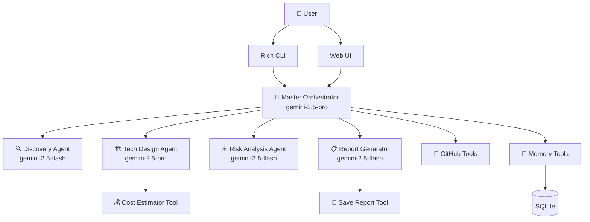

<div align="center">

# 🏗️ ProjectForge AI

### Multi-Agent Software Architect Powered by Google ADK + Gemini

[](https://python.org)
[](https://google.github.io/adk-docs/)
[](https://ai.google.dev)
[](LICENSE)
[](tests/)

*Tell me your project idea. I'll give you a complete architecture document.*

</div>

---

## 📋 What Is This?

**ProjectForge AI** is a multi-agent AI system that acts as your **senior software architect**. You describe a project idea — even a vague one — and it takes you through a structured 5-stage analysis to produce a professional, shareable project document.

It doesn't just answer questions. It **asks incisive questions**, **challenges assumptions**, **surfaces hidden risks**, and **suggests strategies you haven't considered**.

### The 5-Stage Workflow

```
🔍 Discovery → 🏗️ Technical Design → ⚠️ Risk Analysis → 📚 Learning Path → 📋 Report
```

| Stage | What Happens |
|-------|-------------|
| **Discovery** | Agent interviews you to understand the *real* problem (not just your stated idea) |
| **Technical Design** | Architecture pattern, tech stack, database schema, API endpoints, milestones |
| **Risk Analysis** | 5-10 specific failure modes with impact, probability, and mitigations |
| **Learning Path** | Personalized resources for your team to learn the recommended stack |
| **Report** | Professional Markdown document you can share with stakeholders |

---

## 🏛️ Architecture



**Key Design Decisions:**
- **Google ADK** for multi-agent orchestration (sub-agent delegation pattern)
- **Gemini 2.5 Pro** for the orchestrator and complex design reasoning
- **Gemini 2.5 Flash** for focused sub-agents (faster, cheaper)
- **SQLite** for session persistence (zero-config, survives restarts)
- **Dual interfaces** — CLI for developers, Web UI for visual users

---

## 🚀 Quick Start

### Prerequisites
- Python 3.10 or higher
- [Google Gemini API Key](https://aistudio.google.com/apikey) (free tier available)

### Installation

```bash
# 1. Clone the repository
git clone https://github.com/Laharsolanki/ProjectForge-AI.git
cd ProjectForge-AI

# 2. Create and activate virtual environment
python -m venv .venv
# Windows:
.venv\Scripts\activate
# macOS/Linux:
source .venv/bin/activate

# 3. Install dependencies
pip install -r requirements.txt

# 4. Configure API key
copy .env.example .env        # Windows
# cp .env.example .env        # macOS/Linux

# Edit .env and add your Gemini API key
```

### Run

```bash
# Interactive CLI (recommended for first use)
python main.py cli

# Web interface
python main.py web
# Open http://127.0.0.1:8000 in your browser

# ADK Dev Tools (inspect agent execution)
adk web agents
```

---

## 📂 Project Structure

```
ProjectForge-AI/
├── agents/                  # Agent definitions
│   ├── orchestrator.py      # Master orchestrator (root agent)
│   ├── discovery.py         # Stage 1: Problem understanding
│   ├── tech_design.py       # Stage 2: Architecture design
│   ├── risk_analysis.py     # Stage 3: Risk identification
│   └── report_generator.py  # Stage 5: Document assembly
├── prompts/                 # System prompts for each agent
│   ├── orchestrator_prompt.py
│   ├── discovery_prompt.py
│   ├── tech_design_prompt.py
│   ├── risk_prompt.py
│   └── report_prompt.py
├── tools/                   # Custom ADK tools
│   ├── cost_estimator.py    # Cloud cost estimation (AWS/GCP/Azure)
│   ├── github_tools.py      # Repo & issue creation
│   ├── report_tools.py      # Report saving & Mermaid diagrams
│   └── memory_tools.py      # Cross-session project memory
├── web/                     # Web interface
│   ├── app.py               # FastAPI server + WebSocket
│   ├── templates/index.html # Chat UI
│   └── static/              # CSS + JavaScript
├── tests/                   # Unit tests (28 tests)
│   ├── test_tools.py
│   └── test_models.py
├── memory/                  # Persisted project data (auto-created)
├── reports/                 # Generated reports (auto-created)
├── config.py                # Centralized configuration
├── models.py                # Pydantic data models (15 models)
├── cli.py                   # Rich terminal interface
├── main.py                  # Entry point
└── requirements.txt         # Python dependencies
```

---

## 🛠️ Custom Tools

| Tool | Purpose | Requires API? |
|------|---------|--------------|
| **Cost Estimator** | Estimates monthly cloud costs for AWS/GCP/Azure based on services and scale | ❌ Offline (heuristic pricing tables) |
| **GitHub Tools** | Creates repositories and issues from generated milestones | ✅ `GITHUB_TOKEN` (optional) |
| **Report Tools** | Saves reports as Markdown, generates Mermaid architecture diagrams | ❌ Local filesystem |
| **Memory Tools** | Saves/loads project summaries across sessions | ❌ Local JSON files |

---

## 🧪 Testing

```bash
# Run all tests
python -m pytest tests/ -v

# Expected: 28 passed
```

Tests cover:
- ✅ Pydantic model creation, serialization, and roundtrip parsing
- ✅ Cost estimator across all providers and scales
- ✅ Report saving with filename sanitization
- ✅ Mermaid diagram generation
- ✅ Memory save/load/list operations

---

## ⚙️ Configuration

| Variable | Required | Default | Description |
|----------|----------|---------|-------------|
| `GOOGLE_API_KEY` | ✅ Yes | — | Gemini API key from [AI Studio](https://aistudio.google.com/apikey) |
| `GITHUB_TOKEN` | ❌ No | — | GitHub PAT for repo/issue creation |
| `ORCHESTRATOR_MODEL` | ❌ No | `gemini-2.5-pro` | Model for orchestrator + tech design |
| `WORKER_MODEL` | ❌ No | `gemini-2.5-flash` | Model for sub-agents |
| `WEB_HOST` | ❌ No | `127.0.0.1` | Web server bind address |
| `WEB_PORT` | ❌ No | `8000` | Web server port |

---

## 📊 Technology Stack

| Category | Technology | Version |
|----------|-----------|---------|
| Runtime | Python | 3.13+ |
| AI Framework | Google ADK | 2.3.0 |
| LLM Provider | Google Gemini | 2.5 Pro + Flash |
| Web Framework | FastAPI | 0.138 |
| CLI Framework | Rich | 15.0 |
| Data Validation | Pydantic | 2.13 |
| Session Storage | SQLite | Built-in |
| Testing | pytest | 9.1 |
| GitHub API | PyGithub | 2.9 |

---

## 🤝 Contributing

Contributions are welcome! Please:

1. Fork the repository
2. Create a feature branch (`git checkout -b feature/amazing-feature`)
3. Commit your changes (`git commit -m 'Add amazing feature'`)
4. Push to the branch (`git push origin feature/amazing-feature`)
5. Open a Pull Request

---

## 📄 License

This project is licensed under the MIT License — see the [LICENSE](LICENSE) file for details.

---

## 🙏 Acknowledgments

- [Google ADK](https://google.github.io/adk-docs/) — Agent Development Kit
- [Google Gemini](https://ai.google.dev/) — Large Language Model
- [FastAPI](https://fastapi.tiangolo.com/) — Modern Python web framework
- [Rich](https://rich.readthedocs.io/) — Beautiful terminal formatting

---

<div align="center">

**Built with ❤️ using Google ADK + Gemini**

</div>
