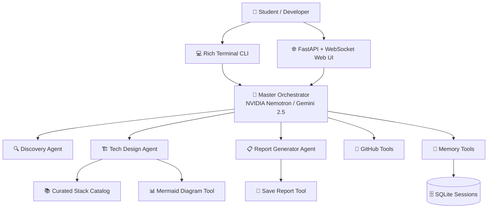

<div align="center">

# 🏗️ ProjectForge AI

### Student Technology Stack Recommender & System Architect Powered by Google ADK

[](https://python.org)
[](https://google.github.io/adk-docs/)
[](https://build.nvidia.com)
[](https://ai.google.dev)
[](tests/)
[](LICENSE)

*Tell me your project idea and what you know. I'll recommend tools that deliberately teach you something new.*

</div>

---

## 📋 What Is ProjectForge AI?

**ProjectForge AI** is a multi-agent AI system designed to act as a **student-centric software architect and technical mentor**. You describe a project idea and your current technical skillset, and the system guides you through a structured 3-stage workflow to produce a personalized, buildable learning roadmap and architecture document.

It doesn't just recommend what is easiest — it **deliberately selects modern tools that teach new programming and architectural paradigms** (e.g., Go's lightweight concurrency, Svelte's compiler reactivity, PostgreSQL transactional discipline, Supabase Row-Level Security).

---

## 🔄 The 3-Stage Workflow

```
🔍 Discovery → 🏗️ Stack Recommendation → 📋 Report Generation
```

| Stage | Focus | Key Output |
|---|---|---|
| **1. Discovery** | Conversational interview | Clarifies project idea, learning goals (Frontend, Backend, Database), and current comfort zone. |
| **2. Stack Recommendation** | Paradigm-shift analysis | Recommends tools from a curated catalog, contrasts new paradigms with familiar stacks, and designs data schemas & API specs. |
| **3. Report Generation** | Roadmap & diagram generation | Assembles a shareable, comprehensive Markdown learning roadmap with Mermaid architecture diagrams and day-by-day milestones. |

---

## 🧠 Multi-LLM Provider Support

ProjectForge AI supports flexible, drop-in LLM providers via **Google ADK**:

- **NVIDIA NIM (Nemotron 3 Ultra 550B)**: High-performance inference via custom `NvidiaLlm` ADK adapter connecting to NVIDIA's API endpoint.
- **Google Gemini (Gemini 2.5 Flash / Pro)**: Native ADK integration with automatic exponential backoff and jitter retries (`HttpRetryOptions`).

Switch providers effortlessly via the `LLM_PROVIDER` environment variable (`nvidia` or `gemini`).

---

## 🏛️ System Architecture



### Key Architectural Highlights
- **Google ADK Multi-Agent Orchestration**: Specialized sub-agents managed by a central orchestrator with clean single-voice relay.
- **Custom ADK LLM Adapters**: Full OpenAI-compatible adapter (`nvidia_llm.py`) bridging ADK agents to NVIDIA NIM and other endpoints.
- **Persistent State**: SQLite session storage via `DatabaseSessionService` across turns and reboots.
- **Dual User Interfaces**: Rich terminal CLI with ASCII stage banners and a sleek dark-mode Web UI with live WebSocket streaming.

---

## 🚀 Quick Start

### Prerequisites
- Python 3.10+ (tested on Python 3.13)
- An API Key for **NVIDIA NIM** (e.g. `nvapi-...`) OR **Google Gemini** ([Google AI Studio](https://aistudio.google.com/apikey))

### 1. Clone & Setup

```bash
# Clone the repository
git clone https://github.com/Laharsolanki/ProjectForge-AI.git
cd ProjectForge-AI

# Create and activate virtual environment
python -m venv .venv
# Windows:
.venv\Scripts\activate
# macOS/Linux:
source .venv/bin/activate

# Install dependencies
pip install -r requirements.txt
```

### 2. Configure Environment

Copy `.env.example` to `.env`:

```bash
# Windows
copy .env.example .env

# macOS / Linux
cp .env.example .env
```

Set your preferred provider in `.env`:

```ini
# Option A: NVIDIA NIM (Recommended)
LLM_PROVIDER=nvidia
NVIDIA_API_KEY=your_nvidia_api_key_here
NVIDIA_MODEL=nvidia/nemotron-3-ultra-550b-a55b

# Option B: Google Gemini
LLM_PROVIDER=gemini
GOOGLE_API_KEY=your_gemini_api_key_here
ORCHESTRATOR_MODEL=gemini-2.5-flash
WORKER_MODEL=gemini-2.5-flash
```

### 3. Run ProjectForge AI

#### 🌐 Web Interface (FastAPI + WebSocket)
```bash
python main.py web --port 8000
```
Open **`http://localhost:8000`** in your browser to interact with the responsive chat interface.

#### 💻 Interactive Terminal CLI
```bash
python main.py cli
```

---

## 📂 Project Structure

```
ProjectForge-AI/
├── agents/                      # ADK Agent Definitions
│   ├── orchestrator.py          # Master orchestrator (root agent)
│   ├── discovery.py             # Stage 1: Problem & learning goals discovery
│   ├── tech_design.py           # Stage 2: Stack selection & system architecture
│   └── report_generator.py      # Stage 3: Markdown roadmap assembly
├── prompts/                     # Prompt templates for each agent
│   ├── orchestrator_prompt.py
│   ├── discovery_prompt.py
│   ├── tech_design_prompt.py
│   └── report_prompt.py
├── tools/                       # Custom ADK Tools
│   ├── recommendation_engine.py # Curated technology stack catalog & filters
│   ├── cost_estimator.py        # Cloud cost estimation (AWS/GCP/Azure)
│   ├── github_tools.py          # GitHub repo & issue creation
│   ├── report_tools.py          # Report saving & Mermaid diagrams
│   └── memory_tools.py          # Session memory & project summaries
├── web/                         # FastAPI Web Application
│   ├── app.py                   # FastAPI server + WebSocket streaming
│   ├── templates/index.html     # Chat UI with dynamic stage progress tracker
│   └── static/                  # Vanilla CSS & JavaScript assets
├── tests/                       # Automated Pytest Suite (38 tests)
│   ├── test_models.py           # Pydantic schemas & state validation
│   ├── test_tech_design.py      # Recommendation engine & architectural tools
│   └── test_tools.py            # Cost estimator, memory & report tools
├── memory/                      # Persisted SQLite session database
├── reports/                     # Saved Markdown project roadmaps
├── config.py                    # Central configuration & LLM provider setup
├── nvidia_llm.py                # NVIDIA NIM / OpenAI-compatible ADK model adapter
├── models.py                    # Pydantic data schemas
├── cli.py                       # Rich terminal interface
└── main.py                      # Application entry point
```

---

## 🧪 Automated Testing

ProjectForge AI includes a comprehensive test suite covering data validation, recommendation rules, tool fallbacks, and memory persistence:

```bash
python -m pytest tests/ -v
```

```
============================== 38 passed in 3.42s ==============================
```

Tests verify:
- ✅ `DiscoveryTurn` and `DiscoveryReport` validation & serialization
- ✅ Recommendation filtering excluding familiar technologies
- ✅ Cost estimator fallback to safe defaults with user warnings
- ✅ Mermaid diagram syntax generation and file sanitization
- ✅ SQLite session storage and history retrieval

---

## ⚙️ Configuration Reference

| Environment Variable | Description | Default | Required |
|---|---|---|:---:|
| `LLM_PROVIDER` | Active provider: `nvidia` or `gemini` | `nvidia` (if key set) | ❌ |
| `NVIDIA_API_KEY` | NVIDIA NIM API Key (`nvapi-...`) | — | ✅ (if using NVIDIA) |
| `NVIDIA_BASE_URL` | NVIDIA API base URL | `https://integrate.api.nvidia.com/v1` | ❌ |
| `NVIDIA_MODEL` | NVIDIA model identifier | `nvidia/nemotron-3-ultra-550b-a55b` | ❌ |
| `GOOGLE_API_KEY` | Google Gemini API Key | — | ✅ (if using Gemini) |
| `ORCHESTRATOR_MODEL` | Gemini orchestrator model | `gemini-2.5-flash` | ❌ |
| `WORKER_MODEL` | Gemini worker sub-agent model | `gemini-2.5-flash` | ❌ |
| `GITHUB_TOKEN` | GitHub Personal Access Token (repo/issue creation) | — | ❌ |
| `WEB_HOST` | Web server host address | `127.0.0.1` | ❌ |
| `WEB_PORT` | Web server port | `8000` | ❌ |

---

## 📄 License

Distributed under the MIT License. See [LICENSE](LICENSE) for more information.
